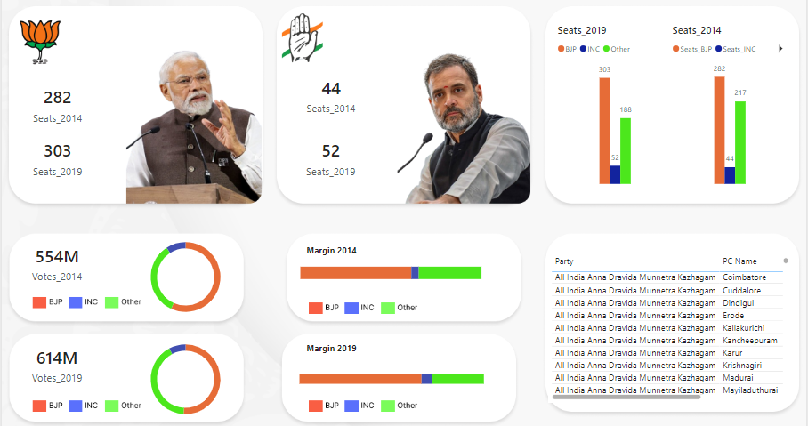

# India General Election Results Analysis (2014 vs 2019)

## Project Overview

This project analyzes the results of the **2014** and **2019** Indian general elections, highlighting key insights such as vote shares, seat distributions, and margin of victory comparisons. The analysis was performed using **Power BI** and **DAX** for data manipulation and visualization.

## Key Features of the Analysis:

- **Seat Comparison (2014 vs 2019)**: 
  - The dashboard compares the number of seats won by major political parties, particularly **BJP** and **INC**, in both elections.
  - **BJP** increased its seat count from **282 in 2014** to **303 in 2019**.
  - **INC** saw a slight increase from **44 seats in 2014** to **52 seats in 2019**.

- **Vote Share**: 
  - Analysis of the total number of votes cast for **BJP**, **INC**, and other parties. 
  - The total votes increased from **554M in 2014** to **614M in 2019**.

- **Margin of Victory**:
  - A comparison of the winning margin percentage for both elections.
  - BJP consistently maintained a strong margin across the elections.

- **Seats Distribution**:
  - Bar charts showing the distribution of seats for **BJP** and **INC** between the two election years.
  
- **Regional Insights**:
  - A breakdown of election results by constituency, with a particular focus on regions like **Tamil Nadu**.

## Technologies Used:

- **Power BI**: 
  - Created interactive visuals and dashboards.
  - Applied **DAX** to manipulate data for more meaningful insights.

- **DAX (Data Analysis Expressions)**:
  - Used for calculating election metrics such as margin of victory and vote share breakdown.

- **CSV Data**:
  - Data from Kaggle, representing election results for **2014** and **2019**.

## Data Sources:

- 

